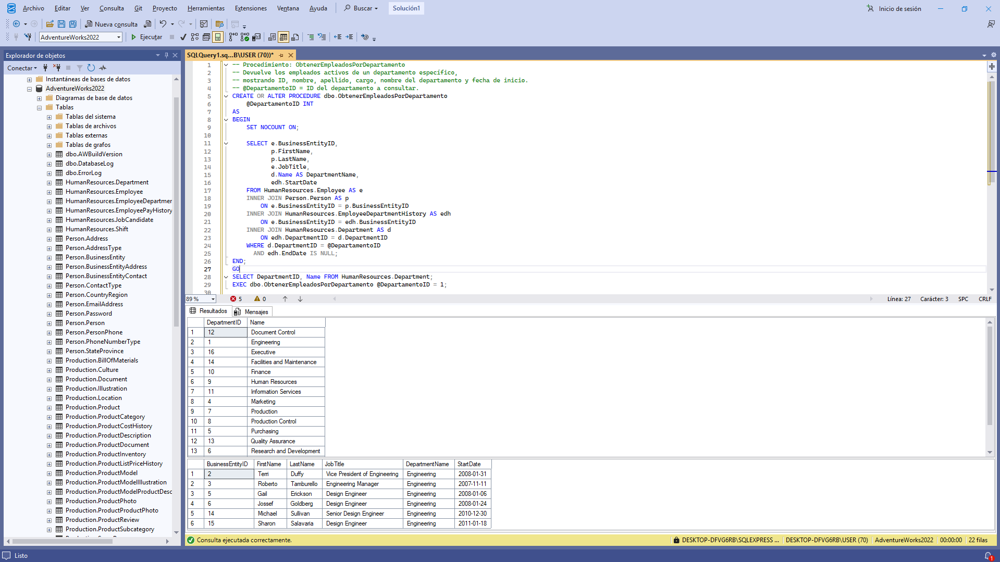

# 📸 Álbum de Fotos
----------------------------------------------------------------------------
Bienvenido a mi álbum personal. Aquí voy guardando una foto por día.

## 📂 Contenido del Álbum
- 📑 **Consultas SQL** → Scripts usados en el proyecto.  
- 🖼️ **Evidencias visuales** → Capturas de resultados (screenshots).  
- 🗂️ **Base de datos** → Archivos `.sql` y documentación relacionada.
 
----------------------------------------------------------------------------

    

    

    

...
...
...
...
...
...
SEMANA 6
...
...
...
...
...
...
...

-- Esta consulta devuelve la lista de empleados con su respectivo departamento.
-- Se usa RIGHT JOIN para asegurar que aparezcan todos los empleados,
-- incluso aquellos que no tengan un departamento asignado (en ese caso, el campo Departamento será NULL).
-- La relación se hace a través de la tabla EmployeeDepartmentHistory.

-- FULL JOIN devuelve todas las filas de ambas tablas:
-- coincidencias, más los registros que no tienen pareja en la otra tabla.

-- CROSS JOIN genera el producto cartesiano:
-- combina cada empleado con cada departamento,
-- sin importar si realmente trabaja allí.

...
...
...
...
...
...
SEMANA 7
...
...
...
...
...
...
...

...
...
...
...
...
...
...
SEMANA 8
...
...
...
...
...
...   

-- Este procedimiento usa una transacción para actualizar el estado de un pedido 
-- en la tabla Sales.SalesOrderHeader de AdventureWorks2022. 
-- Si todo sale bien hace COMMIT; si ocurre un error hace ROLLBACK y lanza la excepción.

-- Este procedimiento almacenado llamado dbo.BuscarPersonasPorApellido
-- recibe un parámetro de entrada llamado @Apellido (de tipo NVARCHAR(50)).
-- Al ejecutarlo, realiza una consulta a la tabla Person.Person de la base de datos AdventureWorks2022,
-- buscando todas las personas cuyo apellido coincida exactamente con el valor pasado en @Apellido.
-- La consulta devuelve el BusinessEntityID, FirstName y LastName de las personas que cumplen con ese criterio.
-- Finalmente, se muestra un ejemplo de ejecución del procedimiento para buscar todas las personas con apellido 'Smith'.
-- La última consulta (SELECT * FROM Person.Person) es para mostrar todos los registros de la tabla Person.Person.

----------------------------------------------------------------------------
